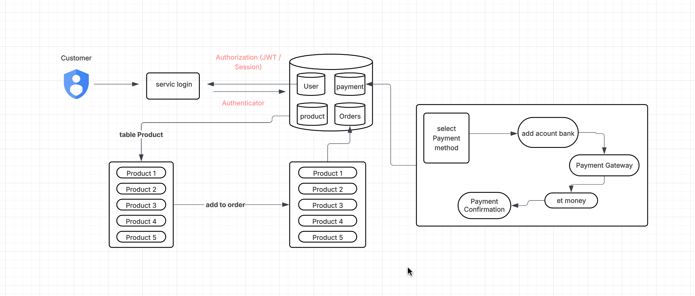
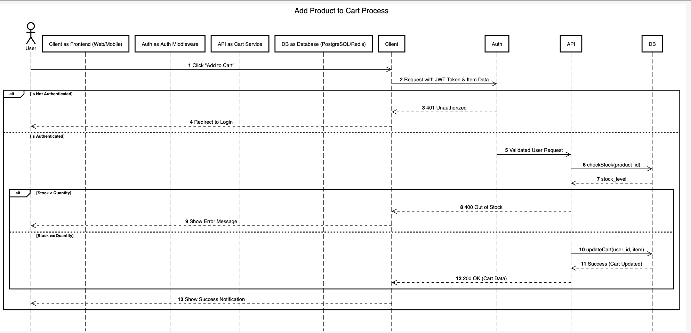

# Talabat Website – Analysis (First App)

## Header / Main Features

1. **Multiple Websites / Projects**
   - Talabat is not just a single website, but a collection of separate sites/projects:
     - Project Introductory
     - Project for Delivery
   - **Advantage:** Updating or editing one site does not affect others. Easy to back up without stopping the entire system.

2. **Multi-language Support**
   - The website supports multiple languages.
   - **Advantage:** Allows users from different nationalities to use the platform easily.

3. **Select Country / Location Filter**
   - Users can select the country or location to filter content.
   - **Advantage:** Determines whether delivery is available for the selected address and customizes search results based on location.

---

## User Profile / Account Features

When a user logs in, the website provides several essential functions:

1. **Account Info**  
   - User information is saved in the database.  
   - When the user logs in again, all information is automatically displayed to facilitate ordering and delivery.

2. **My Orders**  
   - Shows all previous orders.  
   - **Advantage:** Allows users to track order history easily.

3. **Saved Addresses**  
   - Saves delivery addresses for future use.

4. **Saved Cards**  
   - Saves preferred payment methods for future transactions.

5. **Talabat Pay**  
   - Integrated digital payment system within the website.

---

## Search / Delivery Features

1. **Search by Area**  
   - Users can search by area to find available restaurants and delivery options.

2. **All Restaurants**  
   - Displays all restaurants subscribed to Talabat.

3. **Grocery Delivery**  
   - Displays all grocery stores and delivery services.

4. **Order Flower**  
   - Displays all flower delivery providers.

5. **UseCase customer login and add product to card**
  - open web site click in login 

  
---
## Add to cart 


---
## Sequence Diagram - Add to cart

---
## PseudoCode
Add to cart
```javascript
FUNCTION addToCart (items)
    TRY
        AWAIT result FROM Database.push(items)
        RETURN result
    CATCH error
        LOG error.message
        THROW "Custom Error Message"
    ENDTRY
ENDFUNCTION
```
Modify Cart
```javascript
FUNCTION updateToCart (items)
    START TRANSACTION
    TRY
        /
        SET stock = AWAIT Database.checkStock(items)
        IF stock < items.quantity THEN THROW "Out of Stock"

        /
        SET result = AWAIT Database.timelineUpdate(items)
        
        COMMIT TRANSACTION 
        RETURN result
    CATCH error
        ROLLBACK TRANSACTION 
        LOG error.message
        THROW "Update Failed"
    ENDTRY
ENDFUNCTION
```
Delete cart
```javascript
FUNCTION deleteItem(item)
    TRY
        // Ensure atomic deletion
        SET result = AWAIT Database.delete(item)
        RETURN result
    CATCH error
        LOG error.message
        THROW createError('Failed to delete item', 500, 'DELETE_FAILED')
    ENDTRY
ENDFUNCTION
```
## Analytical Notes

- Talabat is **divided into multiple projects**, making management and updates easier without affecting the entire system.  
- **Multi-language support** increases accessibility for a wider audience.  
- **User profile features** improve ordering and delivery experience.  
- **Search and filtering system** is precise, allowing quick access to different services.
